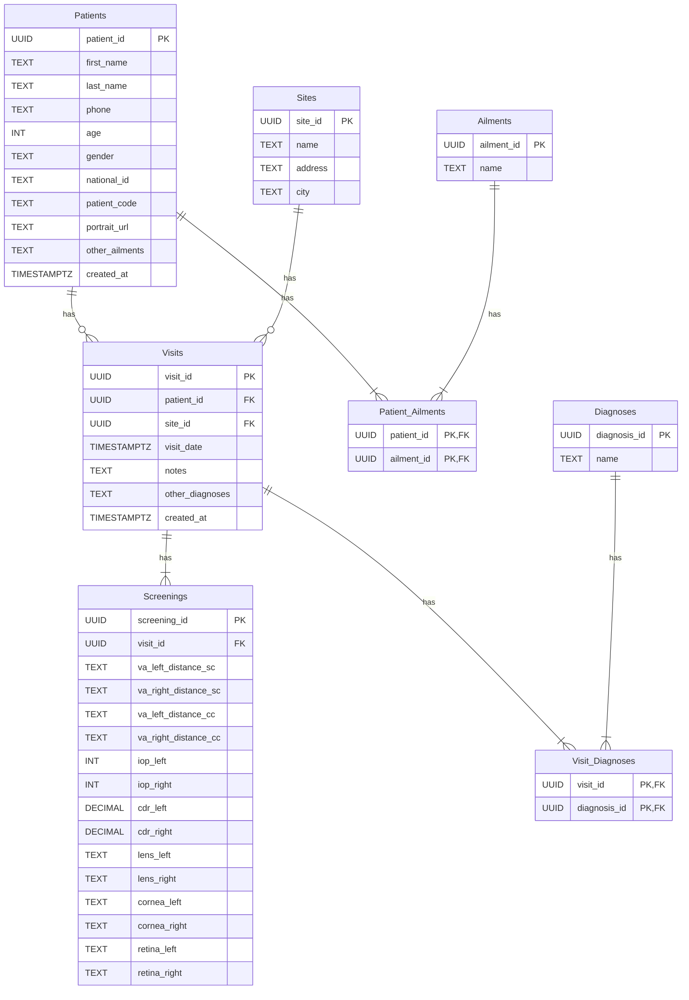

# Clear Path Eye Care

## Project Goal

Clear Path is a mobile application designed to streamline the patient prescreening process for eye care camps in underserved communities. The app will allow healthcare workers to quickly capture patient demographics, basic medical history, and a photo, and then save this information to a central database. This provides a simple, efficient, and offline-capable solution for managing patient data in low-resource settings.

## Database Schema

The application uses a relational database schema to manage patient data, visits, and clinical findings.

## Development Journey

This project was developed iteratively, with a focus on building a robust and user-friendly application. Here is a summary of the key development stages:

1.  **Initial Setup and Exploration:** The project began with a standard Expo starter template. The initial phase involved exploring the codebase, understanding the project structure, and setting up a basic Supabase integration.

2.  **First Schema and Form:** The first iteration of the application featured a simple `patients` table and a basic prescreening form to capture a patient's name and an identifying symbol.

3.  **UI Framework Pivot:** The initial UI was built with standard React Native components. We then explored a "soft UI" design, creating a custom theme and a set of reusable components. However, we ultimately pivoted to **React Native Paper** to implement a more standard and robust Material Design system.

4.  **Global Theming and Dark Mode:** A global theme context was implemented to provide consistent styling across the entire application. This included a settings screen with a toggle to switch between light and dark modes, and a refactor of all screens and components to use the new dynamic theme.

5.  **Advanced Schema and Database Migration:** The initial simple schema was replaced with a much more robust and scalable relational schema. This involved creating tables for patients, visits, screenings, and related lookup tables for ailments and diagnoses. A two-step migration process was used to safely update the database.

6.  **Camera Integration and File Uploads:** The application was enhanced with camera functionality to capture patient photos. This involved:
    *   Installing and configuring `expo-camera`.
    *   Creating a dedicated camera component.
    *   Integrating the camera into the prescreening form with a circular avatar for a more intuitive user experience.
    *   Implementing the logic to upload the captured photo to Supabase Storage and save the URL to the `Patients` table.

7.  **Patient List and Detail Views:** The home screen was transformed into a list of prescreened patients, displaying each patient's photo and name. A dynamic patient detail screen was also created, which uses a parallax effect to display the patient's full information.

8.  **Bug Fixing and Refinements:** Throughout the development process, we addressed numerous bugs and made several refinements, including:
    *   Fixing cross-platform icon issues.
    *   Resolving dependency conflicts.
    *   Correcting layout and styling bugs related to theming and safe areas.
    *   Updating deprecated API calls.

This iterative process has resulted in a stable, feature-rich, and well-designed application that is ready for future development.

---

## Implementation Notes & Lessons Learned

Throughout the development of this project, several key technical lessons were learned that are important to remember for future work:

*   **Safe Area Handling:** The built-in `SafeAreaView` from React Native is deprecated. The correct and modern approach is to use the `SafeAreaProvider` at the root of the application and the `SafeAreaView` component from the `react-native-safe-area-context` library to handle device notches and other system UI elements.

*   **File Uploads to Supabase:** The `supabase-js` v2 library is optimized to work directly with `FormData`. The most robust and correct way to upload files (like images from the camera) is to append the file URI to a `FormData` object and pass it to the `upload()` method. This avoids deprecated `expo-file-system` methods and unnecessary base64 conversions.

*   **Methodical Development:** This project highlighted the importance of a step-by-step, iterative development process. Attempting to implement too many changes at once can lead to a cascade of hard-to-trace bugs. A more deliberate approach of planning, implementing, and verifying each step individually leads to a more stable and higher-quality result.
